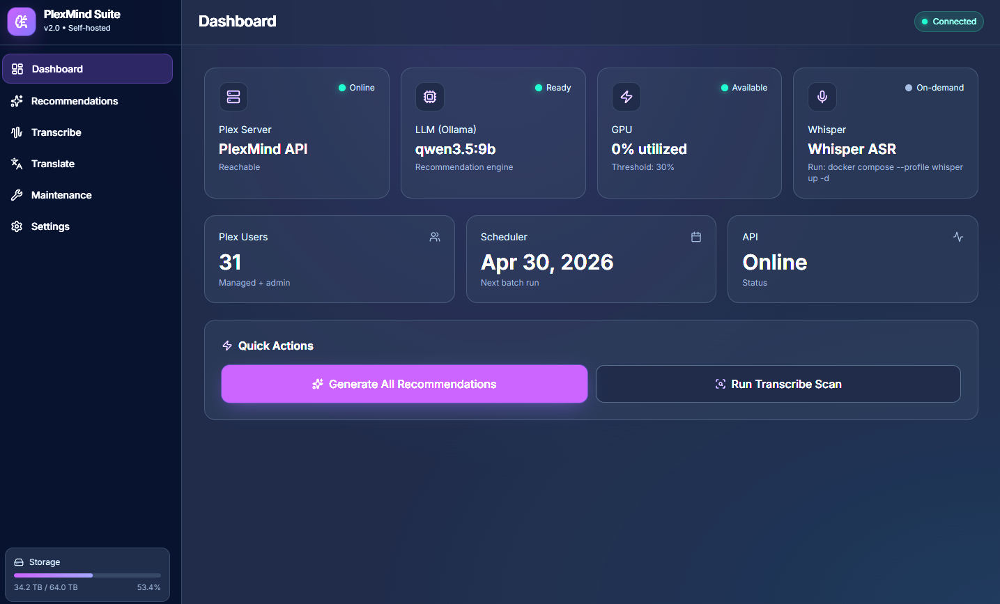

# PlexMind Suite

**Your Plex library finally understands what you actually want to watch.**

[](https://finechainesium.github.io/PlexMind/)
[](https://www.python.org/)
[](https://fastapi.tiangolo.com/)
[](https://ollama.ai/)
[](LICENSE)

Stop scrolling. PlexMind is a fully-local AI stack with a modern web GUI that generates eerily accurate movie/TV recommendations, backfills missing subtitles, and auto-translates them — all running on your own hardware with zero API costs.

> **[🎮 Try the Interactive Demo →](https://finechainesium.github.io/PlexMind/)**
>
> Full dashboard with mock data (alex/jamie/morgan). No install, no backend required.

No cloud. No subscriptions. No data leaving your server.

---

## ✨ What's New in v2.0

- **🖥️ Web GUI** — Built-in dashboard at `http://localhost:8000` (disable with `PLEXMIND_NO_GUI=true`)
- **📊 Live metrics** — Real GPU % and disk usage in dashboard (not demo values)
- **👥 Per-user sync** — Admin → Watchlist, users → 2 playlists
- **🧠 Smarter LLM** — Qwen 3.5 9B with 100% JSON reliability
- **⚡ 60x faster** — Prefilter cuts TMDB calls from 3,000 to 100
- **🔒 Hardened** — API key auth, rate limiting, network isolation
- **📦 Unraid CA** — One-click install from Community Applications

## Why PlexMind?

Plex's built-in recommendations are generic. Third-party tools phone home. PlexMind runs a local LLM that actually *reads* your watch history, understands your taste, and picks from *your* library — not what's trending on Netflix.

**The difference:** Instead of "because you watched Sci-Fi," you get "Because you watched *Blade Runner 2049* and *Arrival*, you'll love *Annihilation* — it's in your library, unwatched, and has that same cerebral sci-fi vibe."

## 🖼️ Dashboard Preview



*Real-time health monitoring, live GPU utilization, disk usage, and per-user controls — all in your browser.*

**[→ Launch Interactive Demo](https://finechainesium.github.io/PlexMind/)**

## Where Recommendations Appear

PlexMind syncs directly to Plex — no separate app needed:

| User Type | Destination | Location in Plex |
|---|---|---|
| **Admin** | **Watchlist** | Home → Watchlist |
| **Managed users** | **"PlexMind Movies"** | Playlists → PlexMind Movies |
| **Managed users** | **"PlexMind TV Pilots"** | Playlists → PlexMind TV Pilots |

> **Note:** TV recommendations are pilot episodes only — perfect for discovering new shows without commitment.

## What's Inside

| Component | What It Does | Why It Matters |
|---|---|---|
| **🧠 PlexMind** | FastAPI + Ollama LLM analyzes watch history | Actually understands taste, explains *why* |
| **🎙️ Transcribe** | Whisper ASR generates `.srt` for missing subs | Works on foreign films, anime, obscure rips |
| **🌐 Translate** | Neural translation to any language | Auto-generates bilingual tracks |
| **🔧 Maintenance** | Audit, dedup, PGS cleanup | Finds cruft Plex misses |
| **🖥️ Web UI** | Dashboard at `:8000` (optional) | Zero CLI required |

## Quick Start

### Unraid (Recommended)

1. Community Applications → Search "PlexMind"
2. Install, set `PLEX_URL` and `PLEX_TOKEN`
3. Open `http://[unraid-ip]:8000`

### Docker Compose

```bash
git clone https://github.com/FineChAInesium/PlexMind.git
cd PlexMind
cp .env.example .env

# Edit .env — set these four:
# PLEX_URL=http://192.168.1.10:32400
# PLEX_TOKEN=your_token_here
# MOVIES_DIR=/mnt/media/Movies
# TV_DIR=/mnt/media/TV

./setup.sh
```

Open **http://localhost:8000** — that's it.

`setup.sh` will:
- Detect GPU VRAM and pick optimal model
- Pull `qwen3.5:9b` (12GB) or `gemma3:4b` (8GB)
- Start PlexMind + Ollama
- Leave Whisper stopped (start via GUI when needed)

## Web Dashboard

The dashboard is served directly from FastAPI — no Node.js, no build step.

**Access:** `http://<your-server>:8000`

**New in v2.0:**
- **Live GPU card** — Shows real utilization % from `/api/scheduler/status` (was "Unknown")
- **Live storage bar** — Real disk usage from `/api/storage`, updates every 60s (was hardcoded)
- **Settings page** — API key field saves to localStorage, auto-sent with requests. 403 errors link to Settings.
- **Smart defaults** — Uses `window.location.origin` for API base (was hardcoded to localhost, broke LAN access)
- **API-only mode** — Set `PLEXMIND_NO_GUI=true` to disable dashboard entirely

| Tab | Features |
|---|---|
| **Dashboard** | Health cards (API, LLM, GPU %, Whisper), user count, next run, disk usage — polls every 30s |
| **Recommendations** | User table, playlist destinations, one-click Generate, live previews |
| **Transcribe** | Model selector, lifetime stats, docker command |
| **Translate** | Target languages, stats, docker command |
| **Maintenance** | Audit, dedup, PGS clean — with exact commands |
| **Settings** | `API_BASE_URL` and `API_KEY` (stored in localStorage) |

## API Reference

Interactive docs: `http://localhost:8000/docs`

| Endpoint | Method | Purpose | New |
|---|---|---|---|
| `/health` | GET | LLM ready state | |
| `/api/users` | GET | List Plex users | |
| `/api/users/{id}/recommendations` | GET | Get cached picks | |
| `/api/users/{id}/recommendations?force=true` | POST | Regenerate | |
| `/api/users/{id}/feedback` | POST | Like/dislike/watched | |
| `/api/run-all` | POST | Background job for all users | |
| `/api/scheduler/status` | GET | Next run, GPU %, busy flag | ✅ v2.0 |
| `/api/storage` | GET | Disk usage (total, used, free, pct) | ✅ v2.0 |
| `/webhook` | POST | Plex webhook (clears cache) | |

**Example:**
```bash
# Get live GPU status
curl http://192.168.1.10:8000/api/scheduler/status
# {"next_run": "2024-01-15T02:00:00", "gpu_utilization_pct": 45, "gpu_busy": true}

# Get disk usage
curl http://192.168.1.10:8000/api/storage
# {"total": 8000000000000, "used": 5200000000000, "free": 2800000000000, "pct": 65}

# Generate recommendations
curl -X POST "http://192.168.1.10:8000/api/users/plex_user/recommendations?force=true" \
  -H "X-API-Key: your_key_here"
```

## Configuration

Key `.env` variables:

| Variable | Description | Example | New |
|---|---|---|---|
| `PLEX_URL` | Plex server (LAN IP) | `http://192.168.1.10:32400` | |
| `PLEX_TOKEN` | From Plex settings | `abc123...` | |
| `MOVIES_DIR` / `TV_DIR` | Host paths | `/mnt/media/Movies` | |
| `OLLAMA_MODEL` | Auto-selected | `qwen3.5:9b` | |
| `WHISPER_MODEL` | `turbo` recommended | `turbo` | |
| `TARGET_LANGUAGES` | CSV | `zh,es-MX,fr` | |
| `PLEXMIND_API_KEY` | API authentication | `openssl rand -hex 32` | |
| `PLEXMIND_NO_GUI` | Disable dashboard | `true` | ✅ v2.0 |
| `CORS_ORIGINS` | For reverse proxy | `*` or `https://plex.example.com` | |

## Demo

**Live demo:** https://finechainesium.github.io/PlexMind/

The demo runs entirely in your browser with mock data for three users (alex, jamie, morgan). No backend, no install.

Features demonstrated:
- Real-time health cards
- Per-user recommendation generation
- GPU and storage metrics
- Settings with API key management
- All dashboard tabs

## Unraid Installation

**Community Applications:**
1. Apps → Search "PlexMind"
2. Install template
3. Set required variables
4. Start

**Template includes:**
- Auto-publish to GHCR on version tags
- Pre-configured paths for Unraid
- NVIDIA runtime support
- Optional GUI toggle

Manual template: `templates/PlexMind.xml`

## Security

Designed for trusted home networks. Hardening options:

**1. API Key (recommended)**
```bash
echo "PLEXMIND_API_KEY=$(openssl rand -hex 32)" >> .env
```
Dashboard will prompt for key and store in localStorage. 403 errors automatically link to Settings page.

**2. Network isolation** (already in compose)
- Ollama: `127.0.0.1:11434` only
- Whisper: internal Docker network only
- Only port 8000 exposed

**3. Disable GUI** (API-only mode)
```bash
PLEXMIND_NO_GUI=true
```

**4. Non-root**
- Container runs as UID 1000
- Media mounts are `:ro`

See [SECURITY.md](SECURITY.md) for full audit.

## CLI (Optional)

```bash
# Transcribe missing subtitles
docker exec plexmind-scripts /app/transcribe.sh

# Translate to target langs
docker exec plexmind-scripts /app/translate.sh

# Maintenance
docker exec plexmind-scripts /app/maintenance.sh all
docker exec plexmind-scripts /app/maintenance.sh dedup
```

## Performance

Real stats from 2,000-title library (RTX 3060 12GB):

- **Scan:** ~45s (100 TMDB calls, not 3,000)
- **Per-user:** 12–24s
- **Transcription:** ~3 min/video (Whisper turbo)
- **Translation:** ~26 min/subtitle (Ollama, chunked)

## Model Selection

| GPU | Model | VRAM | Speed |
|---|---|---|---|
| 24GB+ | `gemma3:27b` | ~18GB | ~35 tok/s |
| 12GB | `qwen3.5:9b` ⭐ | ~6.5GB | ~20 tok/s |
| 8GB | `gemma3:4b` | ~4GB | ~30 tok/s |
| CPU | `gemma3:4b` | RAM | ~3 tok/s |

Auto-configured by `setup.sh`.

## Architecture

```
Browser → :8000 → FastAPI → Ollama
              ↓                ↓
          /api/storage    GPU metrics
          /api/scheduler  ← nvidia-smi
              ↓
          Plex API → TMDB/OMDB
              ↓
    Admin: Watchlist
    Users: Movies + TV Pilots playlists
```

All cached locally. Second run is instant.

## Development

```bash
# Local dev
cd plexmind
pip install -r requirements.txt
uvicorn app.main:app --reload

# Build
docker compose build plexmind

# Disable GUI for testing
PLEXMIND_NO_GUI=true uvicorn app.main:app
```

## Credits

**Structured and originally built by [@FineChAInesium](https://github.com/FineChAInesium), rebuilt from scratch by Claude Opus.**

## License

MIT — see [LICENSE](LICENSE)

---

**Star ⭐ if you use it**
